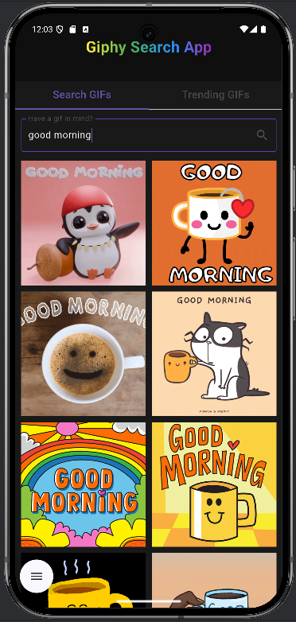

# giphy_search

### Flutter version 3.27.1

 

 

## Getting Started

For help getting started with Flutter development, view the
[online documentation](https://docs.flutter.dev/), which offers tutorials,
samples, guidance on mobile development, and a full API reference.

#### Get the App on your machine
+ clone or copy this git repository into your directory
+ navigate to the project directory
+ open the terminal and run:
`` flutter pub get ``
`` flutter run ``

#### Technical
[x]  Primary platforms - iOS & Android; &nbsp;_(Different api keys for ios and android, as per documentation... implemented CupertinoApp for iOS and MaterialApp widgets for Android but I am not able to test the app on iOS, as I have a Windows computer.)_  
[x]  Auto search - requests to retrieve Gif information from the service are made automatically with a small delay after user stops typing; &nbsp;_(Auto-search method with 1 sec delay with Timer class, handling changes to a text field. Uses onChanged() callback in TextField widget. The search uses the default partial matching logic, I didn't implement a strict matching logic, as I wasn't sure it is necessary.)_  
[x]  Pagination - loading more results when scrolling; &nbsp;_(Used https://pub.dev/packages/infinite_scroll_pagination)_  
[x]  Vertical & horizontal orientation support; &nbsp;_(OrientationBuilder() widget)_  
[x]  Error handling; &nbsp;_(Checks if text input matches any data, unexpected errors, if failed to connect)_  
[x]  Unit tests - as much as you see fit; &nbsp;_(Used http dependencies package with MockClient() to mock fetch requests.)_  

#### UI
[x]  Responsive & matching platform guidelines;  
[x]  At least 2 views sourced by data from Giphy; &nbsp;_(TabBar() views for "Trending" page and "Search" page, and separate view for "Single Gif" view)_  
[x]  Results are displayed in a grid; &nbsp; _(PagedGridView() widget, by the infinite_scroll_pagination package)_, https://pub.dev/packages/infinite_scroll_pagination  
[x]  Clicking on a grid item should navigate to a detailed Gif view. _(Custom GifDetailView widget)_  
[x]  Loading indicators; &nbsp;_(CircularProgressIndicator() widget while fetching GIFs and set a background color before a GIF loads.)_  
[x]  Error display; &nbsp;_(SnackBar() notification widget)_  

#### Bonus points:
[]  Using state management approaches or libraries such as BLoC (flutter_bloc), Riverpod or others;  
[]  Using an understandable architecture pattern;  
[]  Page navigation is separate from page widget code (a Coordinator pattern or similar);  
[]  Network availability handling;  